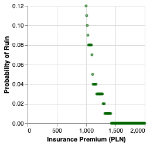
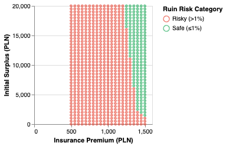
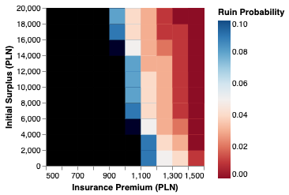
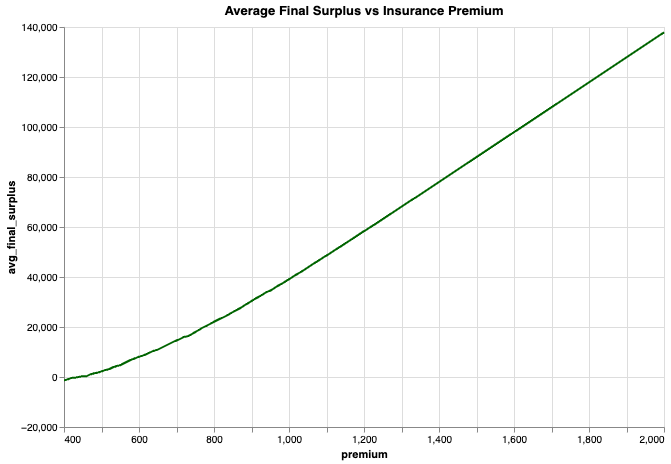

# Insurance premium optimization via simulation modeling

## Project Overview

This project aims to assist **PiTU S.A.**, an insurance company, in optimizing its auto insurance pricing strategy to **minimize the risk of insolvency** while ensuring fair and effective premium levels.

Using **simulation modeling**, the analysis was conducted to support strategic decisions around premium pricing, initial surplus levels, and risk exposure. The simulation addresses critical concerns from the Board of Directors regarding **ruin probabilities**, **expected surpluses**, and **minimum pricing thresholds**.

---

## Dataset & Modeling Structure

Based on the historical data, I successfully indentified the distribution of the following variables:
- the number of claims is well described by a Poisson distribution
- the claim amounts follow a log-normal distribution

Key modeling inputs:
- **Initial Surplus (S₀)**: Starting capital of the insurer.
- **Premium (P)**: Income from each policy.
- **Claim Distribution**: Randomized loss events representing driver claims.
- **Time Horizon**: Fixed simulation period (e.g., 1 year or 1000 policies).
- **Monte Carlo Simulations**: Thousands of repetitions to estimate probability distributions.

Simulation outputs:
- Final surplus for each run
- Ruin occurrence (yes/no)
- Average surplus across simulations
- Ruin probability

---

## Insights Summary

### Relationship between Premium and Ruin Risk

Base on **single-parameter sensitivity analysis** on premium values, these insights are found:
- To avoid insolvency risk, **the premium should be set at least to **`1430 PLN`**.
- Premiums below this value result in negative final surpluses and high risk of ruin.
- To **keep the probability of ruin ≤ 1%**, the **minimum required premium is**: `1320 PLN`.

### Ruin Risk Landscape

- A joint analysis of `(initial surplus, premium)` pairs reveals:
  - High **initial surplus + high premium** ⇒ very low ruin risk.
  - Low **initial surplus + low premium** ⇒ ruin probability > 10%.
  - **Premium plays a more dominant role** than surplus in minimizing risk.

These above insights are also supported by the following heatmap

### Break-Even Premium

- The **"neutral premium"**, where **average final surplus ≈ initial surplus**, is also around **`1430 PLN`**.
- This ensures **long-term financial neutrality**—important for regulatory and competitive pricing strategies.

---

## Recommendations

1. **Set Base Premium ≥ 1430 PLN**  
   To minimize insolvency risk and ensure break-even on average, premiums should be **no lower than 1430 PLN** under current risk assumptions.

2. **Avoid Low-Premium Policies**  
   Premiums below 1320 PLN significantly increase ruin probability, even with a high surplus. These levels should be avoided unless subsidized or highly mitigated by reinsurance.

3. **Use Premium as a Key Risk Lever**  
   Premium pricing has **greater influence** than surplus reserves on reducing risk. Focus pricing strategy on this lever for better solvency control.

4. **Design Tiered Pricing by Risk Profile**  
   Consider **charging higher premiums** for customers in higher-risk segments to ensure that their expected claim losses are adequately covered.

5. **Scenario Testing & Stress Modeling**  
   Extend simulation scenarios to incorporate:
   - Economic downturns
   - Surge in claims
   - Policyholder behavior changes
   This helps test pricing robustness under stress conditions.

---

## Tools & Techniques Used

- Monte Carlo Simulation
- Probabilistic Modeling
- Python (NumPy, Matplotlib, Seaborn)
- Data Visualization
- Risk Analysis & Pricing Strategy
